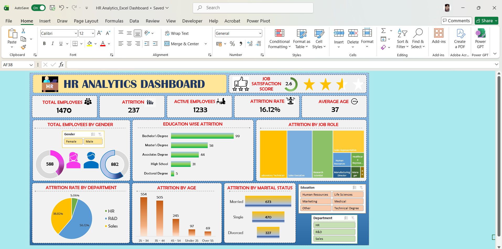
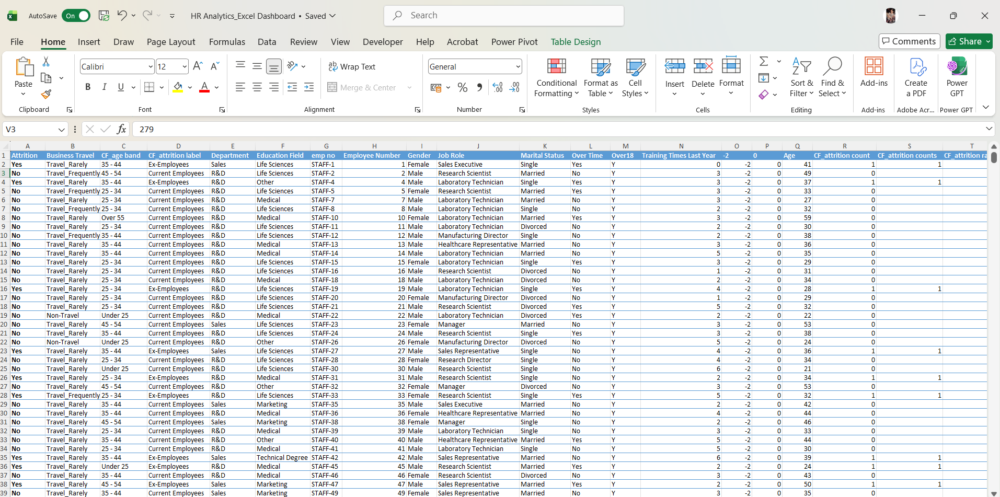

# ***HR Analytics Dashboard (Excel)***

&#x20;

### **Project Overview:**

This project presents an interactive HR Analytics Dashboard created with Microsoft Excel to analyze employee attrition. The dashboard offers a complete view of workforce distribution, attrition trends, and key factors affecting employee turnover, including age, department, education, and job roles. 

### **STAR Method Explanation:**

#### **Situation:**

Employee attrition is an important issue that impacts organizational performance and stability. The HR team needed a clear and visual understanding of attrition patterns across various employee segments to pinpoint problem areas. 

#### **Task:**

The main goals were to: 

* Analyze employee data to understand attrition trends.
* Create a dynamic and interactive dashboard in Excel.
* Identify key factors driving employee attrition.

#### **Action:**

Cleaned and preprocessed data in Excel.

Created several pivot tables to analyze: 

* Attrition by age group
* Attrition by department
* Attrition by job role
* Attrition by education level
* Attrition by marital status

Designed an interactive dashboard featuring: 

* KPI cards (Total Employees, Attrition, Active Employees, Attrition Rate, Average Age),
* Pie charts, bar charts, and tree maps,
* Slicers for filtering (Education, Department, Gender),
* Organized the dashboard to provide both high-level summaries and detailed insights.

#### **Result:**

* Identified an overall attrition rate of **16.12%,**
* Discovered that certain job roles and departments contribute more to attrition,
* Noticed higher attrition among specific age groups and education levels,
* Created a user-friendly dashboard that supports quick, data-driven HR decisions. 

#### **Dashboard:**

#### **Data:**

#### 

#### **Key Insights:**

***Total Employees**:1470

***Total Attrition**:237 employees

***Active Employees**:1233  

***Average Age**:37 years  

***Job Satisfaction Score**:2.6 (indicates moderate to low satisfaction) 

#### **Detailed Insights:**

***Department-wise Attrition:** R\&D has the largest share (\~56%), followed by Sales (\~38%), while HR contributes very little.

***Age-wise Attrition:** Employees in the ***25-34 and 35-44 age groups*** show the highest attrition.

***Education-wise Attrition:** Employees with ***Bachelor’s degree (99)*** and ***Master’s degree (58)*** experience the highest attrition.

***Marital Status:** ***Married employees (673)*** show higher attrition compared to Single and Divorced.

***Job Role Analysis:** Roles like ***Laboratory Technician, Sales Executive, and Research Scientist*** have higher attrition rates.

***Gender Distribution**: Male employees (882) outnumber female employees (588), which may affect attrition distribution.

#### **Recommendations:**

***Improve Job Satisfaction:** Since the satisfaction score is low (2.6), focus on employee engagement, recognition, and improving the work environment.

***Target High-Risk Roles:** Develop strategies to retain employees in roles like Sales Executive and Laboratory Technician.

***Focus on Mid-Career Employees:** Provide career growth opportunities and promotions for employees in the 25-44 age group.

***Department-Level Actions:** Examine R\&D and Sales departments for workload, management issues, or growth limitations.

***Education-Based Retention:** Employees with Bachelor’s and Master’s degrees may seek growth—introduce upskilling and career advancement plans.

***Work-Life Balance Policies:** Especially for married employees, flexible work options and benefits can help reduce attrition

###### **Tools Used:**

**Microsoft Excel:**

* Pivot Tables
* Charts \& Visualization
* Slicers
* KPI Cards
* Data Cleaning

###### **Files Included:**

HR Analytics Dashboard (Excel File).

Dashboard and Data Screenshots

###### **How to Use:**

1\. Open the Excel file 

2\. Use slicers (Education, Department, Gender) to filter data 

3\. Analyze KPIs and charts to understand attrition trends

#### **Conclusion:**

This dashboard shows how Excel can be effectively used for HR analytics. It provides clear insights into employee attrition and helps organizations take proactive steps to improve retention and employee satisfaction.

